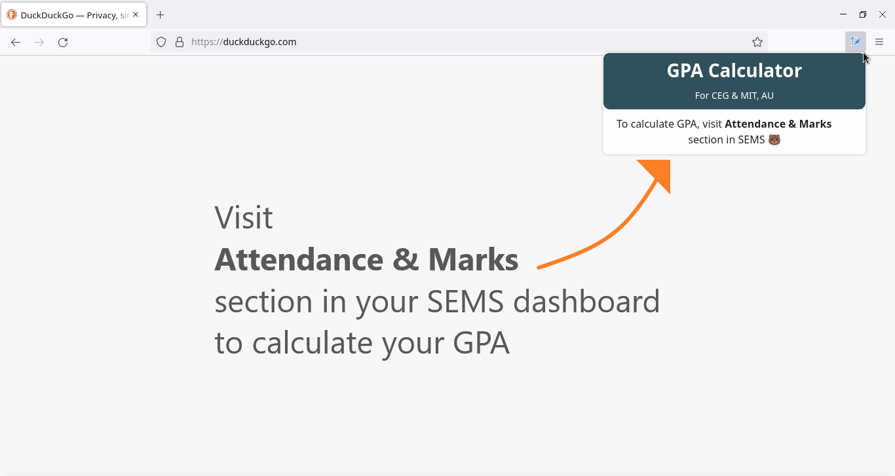
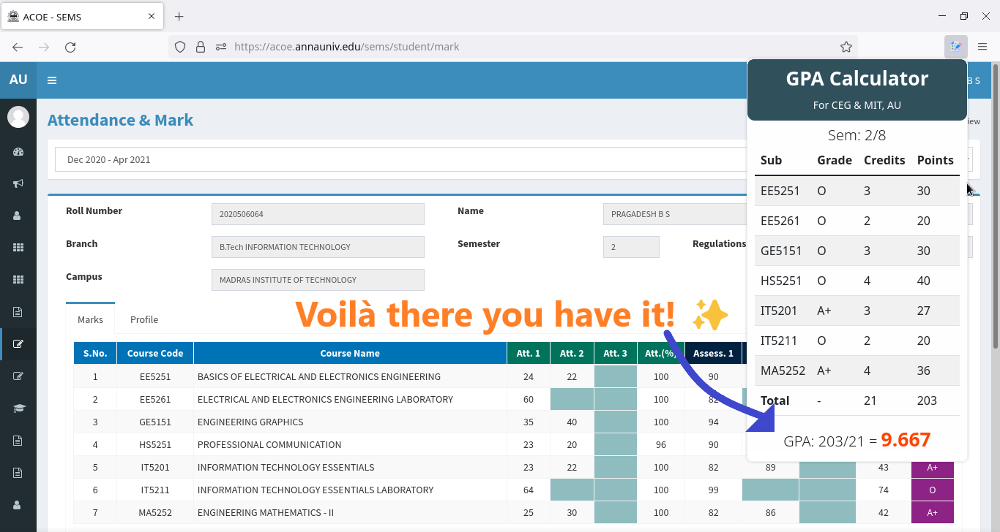

# GPA Calculator

A Firefox extension for calculating GPA for CEG & MIT, Anna University students.

For now, works only for 
* Regulation 2019 - IT, ECE
* Regulation 2018 (RUSA) - CSE

Using Chromium or its forks? Checkout the [Chrome Extension](https://github.com/PragadeshBS/gpaCalcChromeExt)

## Screenshots

## Installation
### Mozilla Firefox, LibreWolf and most other Firefox forks
Grab the extension from [here](https://addons.mozilla.org/en-US/firefox/addon/augpa/)

## Usage
* Visit the **Attendance & Marks** section in your SEMS dashboard.
* Choose the preferred semester for which you want to calculate your GPA. 
* Click on the *GPA Calculator* extension icon in the browser toolbar
* Voilà you get the individual grade points for each subject, as well as the Grade Point Average for that entire semester.

## Privacy and other technical details
#### TL;DR - No collection or sharing of personal information.
The extension reads the DOM only on the *Attendance & Marks* section in your SEMS dashboard, specifically on the url *acoe.annauniv.edu/sems/student/mark*. This is done to get the semester, the subjects for that specific semester and your grades for those subjects. The extension then performs the necessary calculations locally on your machine. It does not transmit / receive any data over the network. This tool being a FOSS, you have the ability to verify the above for yourself. Only you can see your grades.  :cat:

:star2: Found this useful? Star this repo to show your appreciation 
